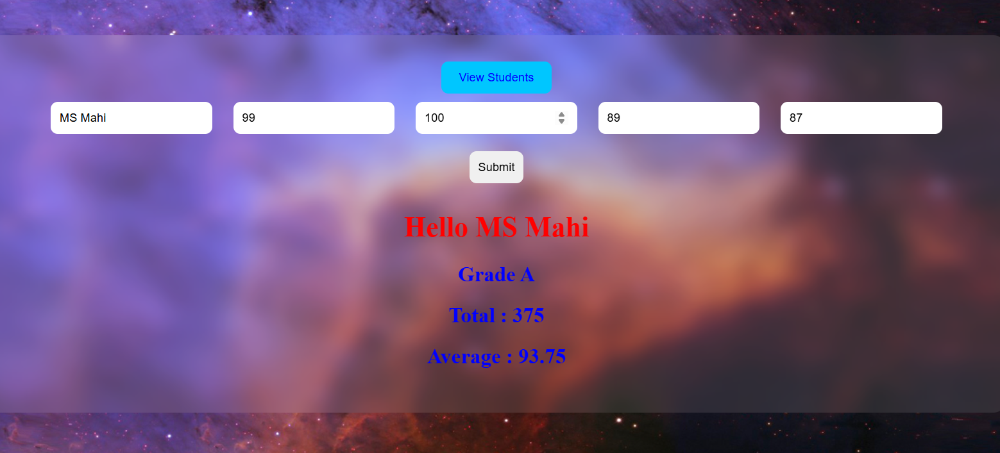

# 🎓 Student Marks Management System

A full-stack Student Marks Management System developed using Django, Django ORM, and PostgreSQL. The application enables users to efficiently manage student academic records, calculate grades automatically, and perform complete CRUD operations through an intuitive interface.


## 📖 Project Overview

The Student Marks Management System is designed to simplify the process of recording and managing student marks. The application automatically calculates total marks, average marks, and grades based on student performance.

The project demonstrates:

* Django CRUD Operations
* Form Handling
* Database Integration
* Business Logic Separation
* Dynamic Grade Calculation
* Data Validation

---

## ✨ Features

### Student Management

* Add New Student Records
* View All Student Records
* Update Existing Student Information
* Delete Student Records

### Automatic Calculations

* Total Marks Calculation
* Average Marks Calculation
* Automatic Grade Assignment

### Validation

* Empty Field Validation
* Marks Validation
* User-Friendly Error Messages

### Grade System

| Average Marks | Grade   |
| ------------- | ------- |
| 90+           | Grade A |
| 80 - 89       | Grade B |
| 70 - 79       | Grade C |
| 50 - 69       | Grade D |
| Below 50      | Fail    |

---

## 🛠 Technologies Used

### Backend

* Python
* Django 4.2

### Frontend

* HTML5
* CSS3

### Database

* PostgreSQL

### Version Control

* Git
* GitHub

---

## 📂 Project Structure

```text
Student-Marks-Management-System
│
├── Naveen
│   ├── migrations
│   ├── admin.py
│   ├── apps.py
│   ├── models.py
│   ├── urls.py
│   ├── utils.py
│   └── views.py
│
├── templates
│   ├── 1412.html
│   ├── view_students.html
│   ├── update_student.html
│   └── confirm_delete.html
│
├── newone
│   ├── css
│   ├── js
│   └── images
│
├── telusko
│   ├── settings.py
│   ├── urls.py
│   ├── asgi.py
│   └── wsgi.py
│
├── assets
├── .gitignore
├── LICENSE
└── README.md
```

---

## ⚙️ Installation

### Clone Repository

```bash
git clone https://github.com/naveenbunny14122512/Student--Marks-Management-System.git
```

### Move to Project Folder

```bash
cd Student--Marks-Management-System
```

### Create Virtual Environment

```bash
python -m venv venv
```

### Activate Virtual Environment

Windows:

```bash
venv\Scripts\activate
```

### Install Dependencies

```bash
pip install django
pip install psycopg2
```

### Apply Migrations

```bash
python manage.py makemigrations
python manage.py migrate
```

### Run Development Server

```bash
python manage.py runserver
```

### Open Browser

```text
http://127.0.0.1:8000/
```

---

## 🗄 Database Design

### Student Model

| Field     | Type         |
| --------- | ------------ |
| id        | BigAutoField |
| Name      | CharField    |
| marks1    | IntegerField |
| marks2    | IntegerField |
| marks3    | IntegerField |
| marks4    | IntegerField |
| total     | IntegerField |
| total_avg | FloatField   |
| Grade     | CharField    |

---

## 🔄 Application Workflow

```text
Student Enters Details
          │
          ▼
     Form Validation
          │
          ▼
   Calculate Total Marks
          │
          ▼
 Calculate Average Marks
          │
          ▼
     Generate Grade
          │
          ▼
 Save Data to Database
          │
          ▼
 View / Update / Delete
```

---

## 🌐 URL Routes

| Route          | Description               |
| -------------- | ------------------------- |
| /              | Home Page                 |
| /SRS/          | Student Registration Form |
| /view/         | View All Students         |
| /update1/<id>/ | Update Student            |
| /delete/<id>/  | Delete Student            |

---

## 🧠 Grade Calculation Algorithm

```python
if average >= 90:
    grade = "Grade A"

elif average >= 80:
    grade = "Grade B"

elif average >= 70:
    grade = "Grade C"

elif average >= 50:
    grade = "Grade D"

else:
    grade = "Fail"
```

---

## 📷 Screenshots

### 🏠 Home Page



### 📝 Student Marks Entry Page


### 📊 Database Table


### 📋 View Student Records


### ✏️ Update Student Record


### 🗑️ Delete Student Record


---

## 🚀 Future Enhancements

* Student Authentication
* Login & Registration System
* Search Functionality
* Pagination
* Export Data to Excel
* PDF Report Generation
* Dashboard Analytics
* Responsive Mobile Design

---

## 💡 Learning Outcomes

Through this project, I gained practical experience in:

* Django Framework
* CRUD Operations
* PostgreSQL Integration
* Form Validation
* URL Routing
* Template Rendering
* Business Logic Separation
* Git & GitHub

---

## 👨‍💻 Author

**Anuganti Naveen**

Python Developer | Django Developer

GitHub:
https://github.com/naveenbunny14122512

---

## ⭐ Support
Please if you like my hardwork. 
consider giving it a ⭐ on GitHub.

